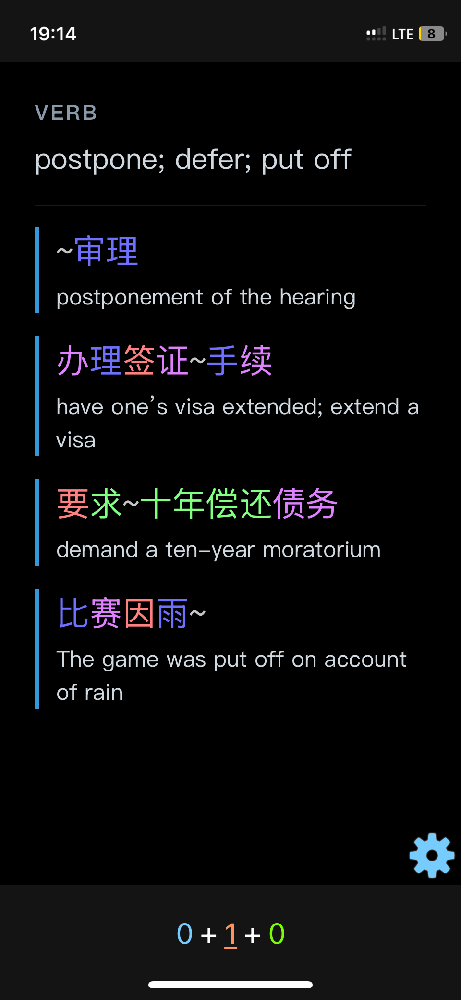
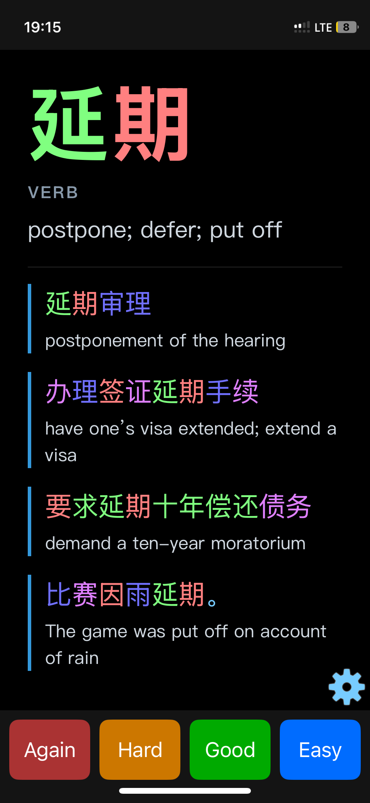
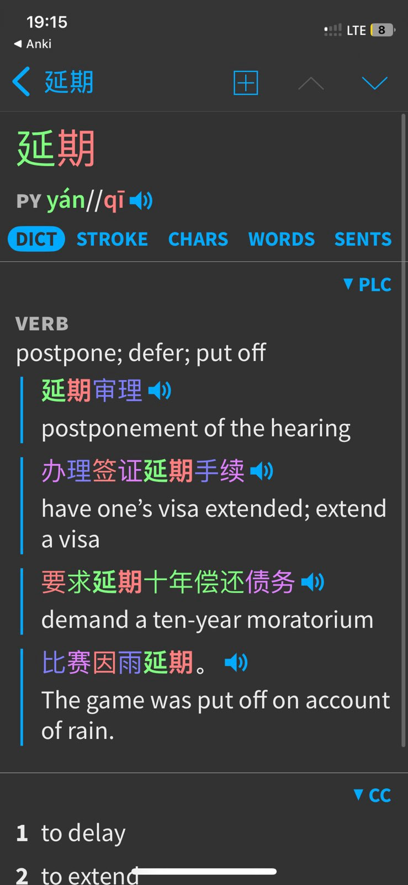

# pleco-to-anki

Convert [Pleco](https://www.pleco.com/) flashcard exports into [Anki](https://apps.ankiweb.net/) decks with per-character tone coloring, cloze-style examples, and Pleco deep links.

The order should be: front (cloze question), back (answer reveal), then Pleco (showing the deep link destination). Let me update:

## Examples

<p align="center">
  
  &nbsp;&nbsp;
  
  &nbsp;&nbsp;
  
</p>

<p align="center">
  <em>Left:</em> Card front — English definition and cloze examples (<code>~</code> replaces the headword).<br>
  <em>Center:</em> Card back — tone-colored headword, pinyin, and full examples.<br>
  <em>Right:</em> Tapping any Chinese text opens the entry in Pleco.
</p>

## What it does

Takes a Pleco flashcard XML export and produces an `.apkg` file you can import into Anki. Each card includes:

- **Headword** with per-character tone coloring
- **Pinyin** with per-syllable tone coloring
- **Part of speech** and **English definition**
- **Up to 4 example phrases**, each with:
  - Tone-colored Chinese characters (every character individually colored)
  - Tone-colored pinyin
  - English translation
  - Cloze versions (headword replaced by `~` in both Chinese and pinyin)

All Chinese text links to Pleco via `plecoapi://` URLs — tap any example to look it up.

## Tone colors

**Dark mode** (default) uses pastel tones for readability on the dark background:

| Tone | Color | Hex |
|------|-------|-----|
| 1st (阴平) | Red | `#ff8080` |
| 2nd (阳平) | Green | `#80ff80` |
| 3rd (上声) | Blue | `#7070ff` |
| 4th (去声) | Purple | `#df80ff` |
| 5th (轻声) | Grey | `#c6c6c6` |

**Light mode** (`--light`) uses saturated tones on a white background:

| Tone | Color | Hex |
|------|-------|-----|
| 1st (阴平) | Red | `#e30000` |
| 2nd (阳平) | Green | `#01b31c` |
| 3rd (上声) | Blue | `#150ff0` |
| 4th (去声) | Purple | `#8800bf` |
| 5th (轻声) | Grey | `#888888` |

Colors are defined as CSS classes (`.t1`–`.t5`), so you can change them from Anki's card styling editor without touching the script.

## Usage

### 1. Export from Pleco

In Pleco: **Flashcards → Import/Export → Export Cards → XML**

This gives you a file like `flash.xml`.

### 2. Run the converter

```bash
pip install genanki
python3 pleco_to_anki.py
```

With no arguments the script picks the latest `.xml` in `xml/` (sorted by filename) and writes the `.apkg` to `apkg/`. So with a typical repo layout:

```
xml/
  2026-03-21.xml
  2026-03-23.xml    ← picked automatically
apkg/
  2026-03-23.apkg   ← output
```

You can also specify paths explicitly:

```bash
python3 pleco_to_anki.py xml/2026-03-21.xml          # specific input → apkg/
python3 pleco_to_anki.py flash.xml -o my_deck.apkg    # custom output
```

Options:

```bash
python3 pleco_to_anki.py --pinyin     # show pinyin on answer side + examples
python3 pleco_to_anki.py --light      # light mode (white background)
```

### 3. Import into Anki

Open Anki → **File → Import** → select the `.apkg` file.

### Updating an existing deck

The deck is safe to re-import after adding new cards in Pleco. Just re-export, re-run the script, and re-import the `.apkg`. Your review history (intervals, ease, due dates) is preserved.

This works because each note's identity is a deterministic hash of its headword (`genanki.guid_for(hw)`). On import, Anki matches notes by this GUID:

- **Same headword** → fields are updated in place; scheduling data is untouched.
- **New headword** → added to the deck as a new card.
- **Deleted from Pleco** → remains in Anki; import never deletes notes.

When the import dialog appears, make sure the duplicate handling is set to **"Update existing notes when first field matches"** (the default). Selecting "Duplicate" would create a second copy of every card.

One thing to avoid: changing the model version string (`"pleco-modular-v3"`) in the script. The `MODEL_ID` is derived from that string; altering it makes Anki treat the notes as a different note type entirely, breaking the GUID matching.

## Card structure

Every card has 21 separate Anki fields. This means you can rearrange, hide, or restyle anything from Anki's template editor without regenerating the deck.

| Field | Description |
|-------|-------------|
| `Hanzi` | Tone-colored headword, wrapped in a Pleco link |
| `Pinyin` | Tone-colored numbered pinyin |
| `POS` | Part of speech (NOUN, VERB, ADJ, etc.) |
| `English` | English definition |
| `HanziRaw` | Plain headword (for searching/sorting) |
| `PinyinRaw` | Plain numbered pinyin |
| `Ex1Chinese` – `Ex4Chinese` | Tone-colored example Chinese, Pleco-linked |
| `Ex1Pinyin` – `Ex4Pinyin` | Tone-colored example pinyin |
| `Ex1English` – `Ex4English` | Example English translations |
| `Ex1Cloze` – `Ex4Cloze` | Example Chinese with headword replaced by `~` |
| `Ex1ClozePinyin` – `Ex4ClozePinyin` | Example pinyin with headword pinyin replaced by `~` |

### Default card layout

**Front** (question): POS, English definition, cloze examples (headword hidden as `~`).

**Back** (answer): Headword, POS, English, full examples. Pinyin is omitted by default; pass `--pinyin` to include it.

### Customizing

Since every piece of data is in its own field, you can edit the card template in Anki to:

- Remove example pinyin (delete `{{Ex1Pinyin}}` lines)
- Show examples only on the back
- Add the headword to the front
- Change the card background, font sizes, etc.

All tone colors are controlled by CSS classes, so editing `.t1 { color: ... }` in the card styling changes every character of that tone at once.

## How it works

The script parses PACE dictionary definitions from the Pleco XML export. These definitions are flat text blobs mixing Chinese, pinyin (with diacritical tone marks), and English, with no consistent delimiters. The parser:

1. Extracts the part of speech and English definition
2. Identifies example phrases by detecting CJK blocks followed by pinyin followed by English
3. Splits pinyin into syllables using a backward-scan algorithm with a known-initials table (handles `zh`/`ch`/`sh`, nasal finals like `n`/`ng`, erhua `儿`, and toneless particles)
4. Aligns pinyin syllables to CJK characters for per-character tone coloring
5. **Drops any example where alignment fails** — better to show fewer clean examples than broken ones

## Limitations

- The PACE definition format is inherently ambiguous. The parser handles ~90% of entries cleanly; some complex multi-sense entries with concatenated example sentences or unusual cross-references will lose examples.
- Per-character tone coloring for examples relies on positional alignment between CJK characters and pinyin syllables. When alignment fails (erhua, glued particles, inconsistent spacing in the source data), the example is excluded.
- Only the PACE dictionary format is supported. Other Pleco dictionaries may use different definition structures.
- The headword's per-character coloring uses the numbered pinyin from the XML (always reliable). Example coloring uses the diacritical pinyin from the definition text (occasionally inconsistent).

## Requirements

- Python 3.8+
- [genanki](https://github.com/kerrickstaley/genanki) (`pip install genanki`)

## License

MIT
